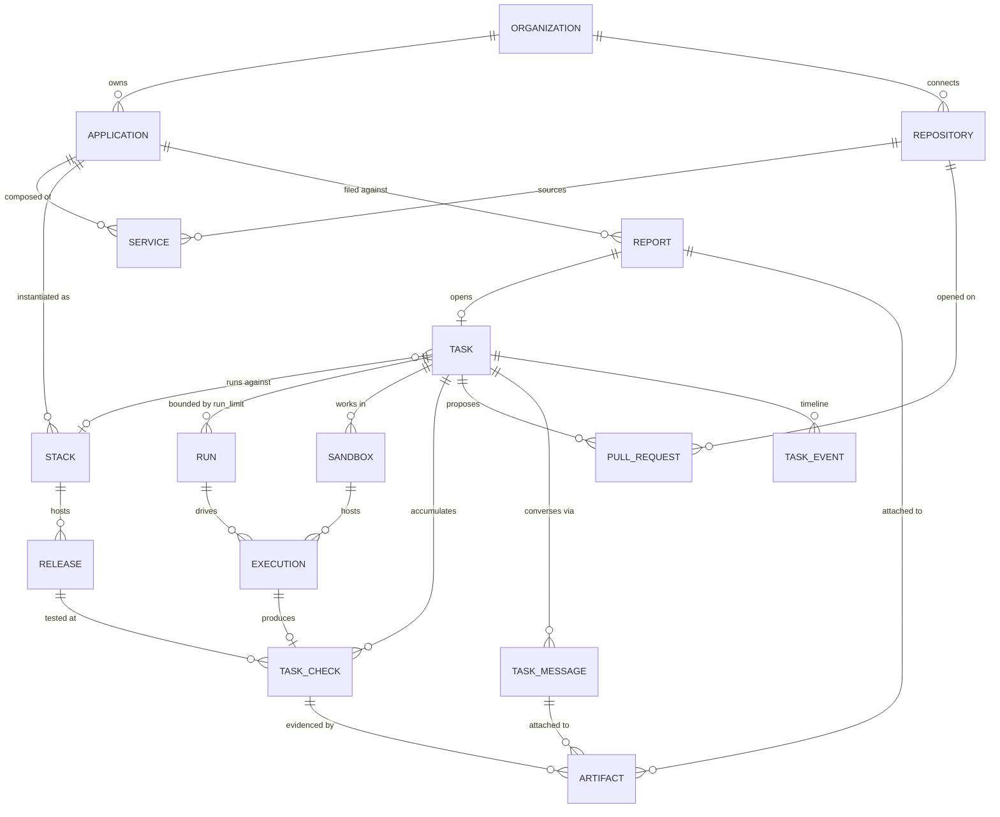

# Stackdome — domain model handover (v2)

Supersedes the earlier handover. Consolidates the modelling sessions that followed the product brief and the pivot to an ephemeral application delivery platform.

Status: model agreed, DDL not yet applied. Open questions in §9 are the ones worth answering before migrations.

---

## 1. What the product is

An ephemeral application delivery platform for agents and humans.

Customers connect an application. Anyone — a person or an agent — can bring up an isolated running copy of that whole application: for a load test, a design revamp, a feature MVP, or a scratch experiment. Issue resolution is one workflow built on top of that capability, not the platform's definition.

The issue-resolution workflow: someone reports a problem, Stackdome brings up the application, an agent reproduces the failure, fixes it, redeploys, verifies against the running app, and hands back a pull request with evidence. The customer reviews and merges. Stackdome never touches production.

Two compute systems run throughout, and keeping them separate is load-bearing:

- **Stack** — the customer's application running for real, with a URL.
- **Sandbox** — an isolated workspace where the agent reads code, edits, and drives browser tests *against* the stack.

This is what lets "the deployment is healthy" and "the fix works" be two independently tracked facts.

---

## 2. Decisions and rationale

Each of these was contested. The rationale matters more than the conclusion — if you revisit one, revisit the reason.

**Stacks are the product; tasks are one consumer.**
Humans spin up stacks directly. A task requests one the same way a designer does. Stacks therefore do not hang off tasks; a stack has a `purpose` and an optional owning task.

**"Environment" and "Deployment" are banned words.**
`Deployment` is a Kubernetes kind and we are a Kubernetes abstraction platform — users see both. `Environment` reads as env vars to half the audience. We already ship **Stack** (the running app) and **Release** (one version of it), so we reuse those and delete the parallel vocabulary. Cost: `Stack` broadens from "the long-lived thing" to "any running copy." Accepted.

**Preview is a purpose, not a type.**
`stack.purpose ∈ (task, preview, load_test, scratch, persistent)`. A per-PR preview and a load-test stack are the same entity with different intent and lifetime.

**Task, not Job or Workflow.**
`Job` is a Kubernetes kind — "job failed" becomes ambiguous in our own UI. `Workflow` implies a DAG engine, which the brief explicitly rules out in favour of a phase enum plus a reconciler; the name would invite a question with no good answer. Both describe *how it runs*; a Task is defined by having an outcome someone cares about. Rejected alternative: `Session` (Devin's word) — better for long interactive work, worse for "did it succeed."

**Service is a first-class table.**
An application is not a repository. `Service` is the runnable unit the Stackfile describes, bound to `(repository, path)` or to no repository at all for stock images. This handles monorepo (two services, one repo), polyrepo (one service each), and umbrella (a config repo with no service code) with one shape. It is also how the agent knows which repository to open a PR against — the question that drove most of this session.

Service rows are a **projection of the Stackfile**, re-derived when `application.synced_at_sha` moves. The Stackfile stays authoritative. It earns a table rather than jsonb because it is queried, FK'd to, and rendered per-service in the UI.

**Repositories are org-level, not application-level.**
A design-system repo feeds several applications. Consequence: Git connection and permissions live at the organization, not under an application.

**Configuration is folded into `application`.**
A 1:1 table that always exists is columns wearing a costume. Bring it back only when Stackfile versioning is real, and then it is a new table, not an unused one.

**Report is problem-shaped intake only.**
Slack, Sentry, Jam, and an agent harness handing over a failure are all "something is wrong here." A branch push, a designer clicking "spin this up," and an API call are not — they create a stack with no report and no task. Forcing them into `report` means four null columns and a confusing UI.

**Task and Report are 1:1 for now, modelled as 1:many-capable.**
When Sentry sends 400 occurrences of one exception, that is many reports and one task. `report.task_id` direction chosen so this generalises without a migration.

**Run, not Attempt.**
One coding attempt within a task, bounded by `run_limit`. A transient API retry (a GitHub 502) is retried in place and does **not** consume a run. A run starts only when the agent must change the code again. A build failure caused by the agent's code does consume one; infra flake does not.

**Sandbox is task-scoped, not run-scoped.**
One sandbox serves many executions across runs, which is how run 2 reads run 1's failing test output.

**Verification is three checks, not a boolean.**
`stack_ready`, `report_reproduced`, `fix_verified`. Named after the *assertion*, not the activity, so `outcome = passed` always means the assertion held — including reproduction, where passing means the bug was observed. Naming them after activities produces dashboards that read backwards.

**Task needs a resolution separate from its phase.**
Phase says where it got to; resolution says whether it worked. The brief requires presenting an unproven proposal as unverified, which `phase = hand_over` cannot express.

**A pull request is one output, not the output.**
A load test produces a report; a designer's stack produces the URL; a fix spanning two services in two repos produces two PRs. The general concept is the task's resolution plus its artifacts.

**Task messages hang off the task, not the run.**
Most blocking questions happen during prepare, before run 1 exists. Conversation is cumulative and humans don't think in runs. Agent messages carry `execution_id` (run is derivable from it); a separate `run_id` would be a second copy of the same fact that can drift.

**Blocking belongs to the task, not the run.**
The execution that asked has usually already exited — the agent asks and terminates rather than idling in a paid sandbox. The answer arriving is what starts the next execution.

---

## 3. Glossary

Use these words in code, UI copy, and conversation. Consistency here is the point.

### The application

| Term | Meaning |
|---|---|
| **Organization** | The customer account. Owns applications and Git connections. |
| **Application** | A customer's system as a whole. Holds its own Stackfile pointer and credentials. |
| **Repository** | A connected Git repo, owned by the organization so it can feed several applications. |
| **Service** | One runnable component: web, api, worker, postgres. Bound to a repository and path, or to neither. |

### The running copy

| Term | Meaning |
|---|---|
| **Stack** | A running copy of an application, with a URL. Not Kubernetes' word for anything. |
| **Purpose** | Why a stack exists: task, preview, load test, scratch, persistent. |
| **Release** | One version deployed into a stack. Many releases per stack; the URL does not change between them. |

### The work

| Term | Meaning |
|---|---|
| **Report** | Problem-shaped intake. Description, expected behaviour, a reporter to go back to. |
| **Task** | A unit of agent work with an outcome someone cares about. |
| **Phase** | Where a running task is. |
| **Resolution** | How a task ended. Null while running. |
| **Run** | One coding attempt, bounded by `run_limit`. |
| **Sandbox** | The isolated workspace where the agent thinks. The stack is where the app runs. |
| **Execution** | One invocation of the coding harness inside a sandbox. Carries the idempotency key and cost. |

### The proof

| Term | Meaning |
|---|---|
| **Check** | An assertion that was tested. "Passed" always means the assertion held. |
| **Artifact** | Screenshot, HAR, test log, recording. Attached to a report, a check, or a message. |
| **Pull request** | One output of a task. A fix spanning two repos produces two. |

### Words we do not use

| Avoid | Because | Say instead |
|---|---|---|
| Environment | Reads as env vars; ambiguous in infra | Stack |
| Deployment | `apps/v1 Deployment` | Release |
| Job | `batch/v1 Job` | Task |
| Workflow | Implies a DAG engine we don't have | Task |
| Attempt | Fine, but we standardised | Run |
| Preview environment | Preview is a purpose, not a type | Stack with purpose = preview |

---

## 4. Entity relationships



Rule of thumb: everything in the work domain hangs off Task. Run is an optional grouping for the coding loop only — checks and executions that happen before run 1 (readiness, reproduction) carry a null `run_id`.

---

## 5. DDL

PostgreSQL. Note that `check` is a reserved word, so the domain term **Check** maps to table `task_check`. This is the one place where the ubiquitous language and the table name deliberately diverge; keep the UI and code saying "check."

```sql
-- ---------- enums ----------
create type repo_provider     as enum ('github','gitlab');
create type stack_purpose     as enum ('task','preview','load_test','scratch','persistent');
create type stack_status      as enum ('provisioning','ready','degraded','expired','torn_down');
create type release_status    as enum ('queued','building','live','failed');
create type report_source     as enum ('web','slack','sentry','jam','harness');
create type task_phase        as enum ('intake','preparing','reproducing','implementing',
                                       'deploying','verifying','hand_over',
                                       'needs_input','failed','cancelled');
create type task_resolution   as enum ('fix_verified','fix_unverified','not_reproduced',
                                       'no_change_needed','abandoned');
create type run_outcome       as enum ('running','passed','failed','abandoned');
create type sandbox_status    as enum ('starting','running','stopped','failed');
create type execution_status  as enum ('starting','running','succeeded','failed','timed_out','cancelled');
create type check_kind        as enum ('stack_ready','report_reproduced','fix_verified');
create type check_outcome     as enum ('passed','failed','inconclusive');
create type artifact_owner    as enum ('report','task_check','task_message');
create type artifact_kind     as enum ('screenshot','har','test_log','recording');
create type pr_state          as enum ('open','merged','closed');
create type message_role      as enum ('user','agent','system');

-- ---------- the application ----------
create table organization (
  id          uuid primary key default gen_random_uuid(),
  name        text not null,
  created_at  timestamptz not null default now()
);

create table repository (
  id              uuid primary key default gen_random_uuid(),
  org_id          uuid not null references organization(id) on delete cascade,
  provider        repo_provider not null,
  external_id     text not null,          -- provider's repo id
  full_name       text not null,          -- acme/acme-api
  default_branch  text not null default 'main',
  created_at      timestamptz not null default now(),
  unique (org_id, provider, external_id)
);

create table application (
  id                       uuid primary key default gen_random_uuid(),
  org_id                   uuid not null references organization(id) on delete cascade,
  name                     text not null,
  slug                     text not null,
  stackfile_repository_id  uuid references repository(id),   -- may be an umbrella repo
  stackfile_path           text,
  synced_at_sha            text,          -- commit the service rows were derived from
  validated_at             timestamptz,
  credentials_ref          jsonb not null default '{}'::jsonb,  -- pointers only, never secrets
  created_at               timestamptz not null default now(),
  unique (org_id, slug)
);

-- projection of the Stackfile; re-derived when synced_at_sha moves
create table service (
  id              uuid primary key default gen_random_uuid(),
  application_id  uuid not null references application(id) on delete cascade,
  repository_id   uuid references repository(id),  -- null for stock images
  name            text not null,
  path            text,                            -- subdir for monorepos
  image           text,                            -- set when not built from source
  unique (application_id, name),
  constraint service_has_a_source check (repository_id is not null or image is not null)
);

-- ---------- the running copy ----------
create table stack (
  id              uuid primary key default gen_random_uuid(),
  application_id  uuid not null references application(id) on delete cascade,
  purpose         stack_purpose not null,
  task_id         uuid,                    -- FK added after task; null for human-created
  created_by      uuid,                    -- user id, null for agent-created
  url             text,
  status          stack_status not null default 'provisioning',
  expires_at      timestamptz,             -- null means no expiry
  created_at      timestamptz not null default now()
);

create table release (
  id          uuid primary key default gen_random_uuid(),
  stack_id    uuid not null references stack(id) on delete cascade,
  run_id      uuid,                        -- FK added after run; null for baseline
  commit_sha  text not null,
  ref         text,
  status      release_status not null default 'queued',
  created_at  timestamptz not null default now()
);
create index on release (stack_id, created_at desc);

-- ---------- the work ----------
create table report (
  id                  uuid primary key default gen_random_uuid(),
  application_id      uuid not null references application(id) on delete cascade,
  source              report_source not null,
  description         text not null,
  expected_behaviour  text,
  reporter            text,
  external_ref        text,                -- sentry issue id, slack ts, jam id
  created_at          timestamptz not null default now()
);

create table task (
  id                 uuid primary key default gen_random_uuid(),
  application_id     uuid not null references application(id) on delete cascade,
  report_id          uuid references report(id),
  stack_id           uuid references stack(id),     -- null until prepare completes
  origin_release_id  uuid references release(id),   -- baseline the failure was reproduced on
  target_branch      text,
  phase              task_phase not null default 'intake',
  resolution         task_resolution,               -- null until terminal
  run_limit          smallint not null default 2,
  lease_owner        text,
  lease_expires_at   timestamptz,
  created_at         timestamptz not null default now(),
  completed_at       timestamptz,
  constraint resolution_only_when_done check (
    resolution is null
    or phase in ('hand_over','failed','cancelled')
  )
);
create index on task (application_id, phase);
create index on task (phase) where phase = 'needs_input';

alter table stack   add constraint stack_task_fk   foreign key (task_id) references task(id);
create unique index one_live_stack_per_task on stack (task_id)
  where task_id is not null and status <> 'torn_down';

create table run (
  id            uuid primary key default gen_random_uuid(),
  task_id       uuid not null references task(id) on delete cascade,
  number        smallint not null,
  candidate_sha text,
  verified_sha  text,                      -- written only on a pass
  outcome       run_outcome not null default 'running',
  started_at    timestamptz not null default now(),
  ended_at      timestamptz,
  unique (task_id, number)
);

alter table release add constraint release_run_fk foreign key (run_id) references run(id);

create table sandbox (
  id           uuid primary key default gen_random_uuid(),
  task_id      uuid not null references task(id) on delete cascade,
  provider     text not null,              -- daytona
  external_id  text,
  status       sandbox_status not null default 'starting',
  created_at   timestamptz not null default now(),
  stopped_at   timestamptz
);

create table execution (
  id               uuid primary key default gen_random_uuid(),
  sandbox_id       uuid not null references sandbox(id) on delete cascade,
  task_id          uuid not null references task(id) on delete cascade,
  run_id           uuid references run(id),        -- null before the first run
  external_id      text,
  session_ref      text,
  idempotency_key  text not null,
  status           execution_status not null default 'starting',
  cost_cents       integer not null default 0,
  started_at       timestamptz not null default now(),
  ended_at         timestamptz,
  unique (idempotency_key)
);

create table task_check (
  id            uuid primary key default gen_random_uuid(),
  task_id       uuid not null references task(id) on delete cascade,
  run_id        uuid references run(id),        -- null for readiness and reproduction
  release_id    uuid references release(id),    -- what was actually tested
  execution_id  uuid references execution(id),  -- null when produced by the deploy service
  kind          check_kind not null,
  outcome       check_outcome not null,
  commit_sha    text,
  ran_at        timestamptz not null default now(),
  constraint fix_checks_need_a_release check (
    kind <> 'fix_verified' or release_id is not null
  )
);
create index on task_check (task_id, ran_at);

create table pull_request (
  id             uuid primary key default gen_random_uuid(),
  task_id        uuid references task(id),      -- null once PR ingest exists
  repository_id  uuid not null references repository(id),
  number         integer not null,
  head_ref       text,
  base_ref       text,
  is_draft       boolean not null default true, -- orthogonal to state
  state          pr_state not null default 'open',
  unique (repository_id, number)
);

create table artifact (
  id          uuid primary key default gen_random_uuid(),
  owner_type  artifact_owner not null,
  owner_id    uuid not null,
  kind        artifact_kind not null,
  url         text not null,                    -- stored outside the sandbox
  meta        jsonb not null default '{}'::jsonb,
  created_at  timestamptz not null default now()
);
create index on artifact (owner_type, owner_id);

create table task_message (
  id            uuid primary key default gen_random_uuid(),
  task_id       uuid not null references task(id) on delete cascade,
  execution_id  uuid references execution(id),  -- set for agent messages
  replies_to_id uuid references task_message(id),
  role          message_role not null,
  body          text not null,
  blocking      boolean not null default false,
  answered_at   timestamptz,
  created_at    timestamptz not null default now()
);
create index on task_message (task_id, created_at);
create index on task_message (task_id) where blocking and answered_at is null;

create table task_event (
  id       uuid primary key default gen_random_uuid(),
  task_id  uuid not null references task(id) on delete cascade,
  kind     text not null,
  payload  jsonb not null default '{}'::jsonb,
  at       timestamptz not null default now()
);
create index on task_event (task_id, at);
```

### Notes on the DDL

- `stack.task_id` and `release.run_id` are declared before their targets exist, so the FKs are added afterwards. Reorder if your migration tool dislikes it.
- The partial unique index on `stack (task_id)` enforces one live stack per task.
- `execution.idempotency_key` is what stops a reconciler restart from launching a duplicate execution. Format used in the reference flow: `T1:repro`, `T1:run1`, `T1:run1:verify`.
- `task.lease_owner` is claimed by conditional update; expired leases are rediscovered from the table after a crash.

---

## 6. Lifecycle

```
intake → preparing → reproducing → implementing → deploying → verifying → hand_over
                                        ↑                          |
                                        └──────── failed, under run_limit
```

Any phase can divert to `needs_input`, `failed`, or `cancelled`. Locally-verifiable tasks skip `deploying`.

`phase` is authoritative state. The UI timeline is derived from `task_event`, not from an ordered step table.

For list views, derive a coarse status rather than showing nine phases in a pill: **running** / **needs you** / **ready for review** / **failed**.

---

## 7. Reference flow — a 500 on checkout

Acme Shop. Repos `acme-web`, `acme-api`. `+` insert, `~` update.

**0. Setup (once).** `+ organization` ORG1 · `+ repository` R1, R2 · `+ application` A1 (stackfile in R2) · `+ service` SV1 web→R1, SV2 api→R2, SV3 worker→R2 `/worker`, SV4 postgres (no repo).

**1. Intake.** `+ report` RP1 (source=web) · `+ artifact` AR1 (screenshot→report) · `+ task` T1 (phase=intake, stack_id=null) · `+ task_event`.

**2. Prepare.** `~ task` (lease, phase=preparing) · `+ stack` ST1 (purpose=task) · `~ task` (stack_id=ST1) · `+ release` RL1 (a1b2c3, baseline) → `~` live · `~ stack` (ready, url) · `+ task_check` C1 (stack_ready, passed) · `~ task` (origin_release_id=RL1).

**3. Reproduce.** `~ task` (phase=reproducing) · `+ sandbox` SB1 · `+ execution` X1 (`T1:repro`, run=null) → `~` succeeded · `+ task_check` C2 (report_reproduced, RL1, passed) · `+ artifact` AR2, AR3.

**4. Needs input.** `+ task_message` M1 (agent, blocking, execution=X1) · `~ task` (phase=needs_input) · `+ task_message` M2 (user) · `~ M1` (answered_at) · `~ task` (phase=implementing).

**5. Run 1.** `+ run` RN1 · `+ execution` X2 (`T1:run1`) → `~` succeeded, 640¢ · `~ run` (candidate=d4e5f6) · `+ pull_request` P1 (acme-api #88, draft).

**6. Deploy.** `~ task` (phase=deploying) · `+ release` RL2 (d4e5f6, run=RN1) → `~` live · `+ task_check` C3 (stack_ready, passed).

**7. Verify — fails.** `~ task` (phase=verifying) · `+ execution` X3 (`T1:run1:verify`) · `+ task_check` C4 (fix_verified, RL2, failed) · `+ artifact` AR4, AR5 · `~ run` RN1 (failed, verified_sha stays null).

**8. Run 2 — passes.** `+ run` RN2 · `+ execution` X4 · `~ run` (candidate=77aa88) · `+ release` RL3 → live · `+ task_check` C5 (stack_ready, passed) · `+ execution` X5 · `+ task_check` C6 (fix_verified, RL3, passed) · `+ artifact` AR6, AR7 · `~ run` RN2 (verified_sha=77aa88, passed).

**9. Hand over.** `~ pull_request` (is_draft=false) · `~ task` (phase=hand_over, resolution=fix_verified) · `~ sandbox` (stopped) · `~ stack` (expires_at=now+72h).

**10. Human merges.** `~ pull_request` (merged) · `~ stack` (torn_down).

**Tally:** 1 report, 1 task, 1 stack, 3 releases, 2 runs, 1 sandbox, 5 executions, 6 checks, 7 artifacts, 1 PR, 2 messages.

---

## 8. MVP scope

### Build

Persisted tasks, one active investigation at a time, a bounded correction loop, real deploy status, real test evidence. One representative application, one coding harness, one input path (web form with a screenshot).

### Screens

| Screen | Reads |
|---|---|
| Tasks list | task + report, coarse status, run count, resolution |
| Task detail | phase stepper, `task_event` timeline, checks with artifacts, runs including failed ones, stack URL, PR link |
| Needs input | blocking `task_message` with a reply box |
| New report | description, expected behaviour, screenshot, application picker |
| Stack detail | stack URL, status, expiry, releases in order, owning task |
| Application config | repositories, services and their repos, Stackfile path, sync status |

### Deferred — modelled but not built

- **`release_service`** — per-service commits for multi-repo releases. `release.commit_sha` holds one commit until the demo app needs a second. Promoting a column to a child table later is an ordinary migration.
- **Stackfile versioning** — the `configuration` table returns only when the agent proposes Stackfile changes.
- **Trigger** — the general intake abstraction above `report`, needed when branch pushes open tasks rather than just stacks.
- **PR webhook ingest and the existing-PR entry point** — make `pull_request.task_id` nullable then.
- **Report dedup** — no `fingerprint` column until Sentry is connected and 400 occurrences arrive.
- **Multi-repo fixes** — the model permits many PRs per task; the MVP should refuse and say so rather than attempt it.
- **Sentry, Jam, Slack connectors; arbitrary repo onboarding; billing; multiple harnesses.**

---

## 9. Open and unclear

Ordered by how expensive they are to get wrong.

**1. Backend discrepancy.** The product brief says the existing **Go** backend coordinates work and the reconciler reuses "the existing worker pattern." Everything else about Stackdome says **NestJS + TypeORM + PostgreSQL**. If the brief was written against a different service, the "Existing" status on deployment services and the 12–16 engineer-day estimate both need re-checking. Resolve this before planning.

**2. Repository sharing.** Modelled as org-level and shareable across applications. This moves Git connection and permissions up a level from where they may sit today. Confirm against the existing implementation.

**3. Concurrency on stacks.** If two tasks target one application at once, do they share a base stack or each get one? The MVP scopes to one active investigation, which dodges it. The schema assumes separate.

**4. Cost enforcement.** `cost_cents` sits on `execution`. "Cost per accepted fix" needs a sum across five rows per task. Hard enforcement needs `budget_cents` and `deadline_at` — per task or per org? That decides where the counter lives. A denormalised `task.cost_cents` is the cheap answer.

**5. Stack lifecycle conflicts.** Triggers are PR merge, TTL, and explicit teardown. Current intent: merge sets `expires_at = now + short` rather than tearing down immediately, so the reviewer's link survives the merge. Confirm which wins when they conflict, and whether a `persistent` stack expires at all.

**6. Stackfile drift.** If a PR changes infra-as-code, the stack's needs diverge from the application's live Stackfile. Re-sync automatically, or surface a drift warning and block? `synced_at_sha` tells you when it last matched.

**7. Onboarding as a task kind.** Stackfile generation produces a reviewable repo change, so the agent could open a PR against config before any bug work. Cheaper to model as a `task.kind` now than to bolt on a separate pipeline later. Not currently in the schema.

**8. Dedup semantics.** When a deduped report matches a task that is already `completed` — new task, or reopen?

**9. `task_check` naming.** The table name diverges from the domain word because `check` is reserved. Confirm the team is comfortable, or pick a different domain word.

---

## 10. Artefacts

- `stackdome-task-flow.html` — animated walkthrough of the reference flow, showing every row as it is written. Useful for onboarding an engineer or briefing a design partner.
- `how-a-bug-becomes-a-pr.html` — illustrated explainer of the model for a non-implementing audience.
